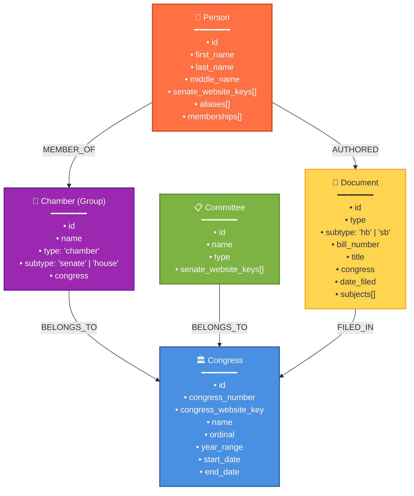

# open-congress-data

Open data for the Philippine Congress: track representatives, senators, bills,
and voting records. Transparent and community-maintained.

## Data Accuracy Note

⚠️ **Important**: The data in this repository is manually encoded and may
contain inaccuracies. We strive for accuracy but human error is possible. If you
discover incorrect information, please report it by opening an issue or
submitting a pull request. Your help in maintaining data quality is greatly
appreciated!

See our [Contributing Guide](CONTRIBUTING.md) for information on how to help
improve the data.

## Data Sources

This project aggregates publicly available information from official Philippine
government sources:

- **Senate of the Philippines**: https://web.senate.gov.ph
- **House of Representatives**: https://congress.gov.ph
- **Legislative Documents and Records**: https://ldr.senate.gov.ph
- **eCongress**: https://econgress.gov.ph

## Data Structure

All data files are organized in the `data/` directory with subdirectories for
each entity type:

- `data/congress/` - Philippine Congress entities (8th through 20th)
- `data/group/chamber/` - Chamber entities (Senate and House of Representatives)
- `data/committee/` - Senate committee entities
- `data/person/` - Senator and representative entities
- `data/document/` - Legislative documents (House Bills and Senate Bills)
  - `data/document/hb/` - House Bills organized by congress number
  - `data/document/sb/` - Senate Bills organized by congress number

The following graph shows the current entities and their relationships in the
dataset:



### Entity Details

- **Congress**: Central entity representing each Philippine Congress (8th through 20th)
- **Chamber (Group)**: Represents Senate or House of Representatives for a specific Congress
- **Committee**: Senate committees that operate within specific congresses
- **Person**: Senators and representatives who serve in various congresses
- **Document**: Legislative documents including House Bills (HB) and Senate Bills (SB)

### Relationship Hierarchy

The data follows a hierarchical structure:

1. **Congress** is the top-level entity
2. **Chambers** (Senate/House) belong to specific Congresses
3. **Committees** belong to specific Congresses
4. **People** are members of Chambers (not directly connected to Congress)
5. **Documents** are filed in specific Congresses and authored by People

This structure accurately represents the bicameral nature of the Philippine Congress, where individuals serve as members of either the Senate or the House of Representatives for specific Congress sessions, and author legislative documents during their service.

### Person Membership Structure

Person entities contain a `memberships` array that defines their chamber affiliations:

```toml
[[memberships]]
type = "chamber"
congress = 15
subtype = "house"  # Person was a House member in 15th Congress

[[memberships]]
type = "chamber"
congress = 16
subtype = "senate"  # Person was a Senator in 16th Congress
```

This allows tracking of politicians who may have served in different chambers across different congresses (e.g., moving from House to Senate).

## Database Synchronization

The repository includes a Neo4j sync script (`scripts/sync_to_neo4j.py`) that imports all data into a graph database for advanced querying and analysis.

### Prerequisites

1. Neo4j database instance (local or remote)
2. Python 3.7+
3. Required Python packages: `neo4j`, `tomlkit`, `pyyaml`, `python-dotenv`

### Setup

1. Create a `.env` file with your Neo4j credentials:
```env
NEO4J_URI=bolt://localhost:7687
NEO4J_USERNAME=neo4j
NEO4J_PASSWORD=your_password
```

2. Install dependencies:
```bash
pip install neo4j tomlkit pyyaml python-dotenv
```

### Running the Sync

```bash
# Normal sync (updates existing data)
python scripts/sync_to_neo4j.py

# Clear database first with confirmation prompt
python scripts/sync_to_neo4j.py --clear

# Clear database without confirmation (for CI/CD)
python scripts/sync_to_neo4j.py --clear --yes
```

The sync script uses several optimizations for fast import:
- **Large batch operations** (1000 documents per batch)
- **Progress tracking** during file loading to monitor sync status
- **Optimized relationship creation** with grouped queries
- **Automatic indexing** for optimal query performance

These optimizations significantly reduce sync time for database operations.

For detailed database schema documentation, see [DATABASE.md](DATABASE.md).

## Impostor Syndrome Disclaimer

**We want your help. No, really.**

There may be a little voice inside your head that is telling you that you're not
ready to be an open source contributor; that your skills aren't nearly good
enough to contribute. What could you possibly offer a project like this one?

We assure you - the little voice in your head is wrong. If you can write code at
all, you can contribute code to open source. Contributing to open source
projects is a fantastic way to advance one's coding skills. Writing perfect code
isn't the measure of a good developer (that would disqualify all of us!); it's
trying to create something, making mistakes, and learning from those mistakes.
That's how we all improve, and we are happy to help others learn.

Being an open source contributor doesn't just mean writing code, either. You can
help out by writing documentation, tests, or even giving feedback about the
project (and yes - that includes giving feedback about the contribution
process). Some of these contributions may be the most valuable to the project as
a whole, because you're coming to the project with fresh eyes, so you can see
the errors and assumptions that seasoned contributors have glossed over.

**Remember:**

- No contribution is too small
- Everyone started somewhere
- Questions are welcome
- Mistakes are learning opportunities
- Your perspective is valuable

(Impostor syndrome disclaimer adapted from
[Adrienne Friend](https://github.com/adriennefriend/imposter-syndrome-disclaimer))

## License

This repository is dedicated to the public domain under **CC0 1.0 Universal (CC0
1.0) Public Domain Dedication**.

You can copy, modify, distribute and perform the work, even for commercial
purposes, all without asking permission.

- No Copyright
- No Rights Reserved
- No Attribution Required

For more information, see the
[CC0 1.0 Universal license](https://creativecommons.org/publicdomain/zero/1.0/).